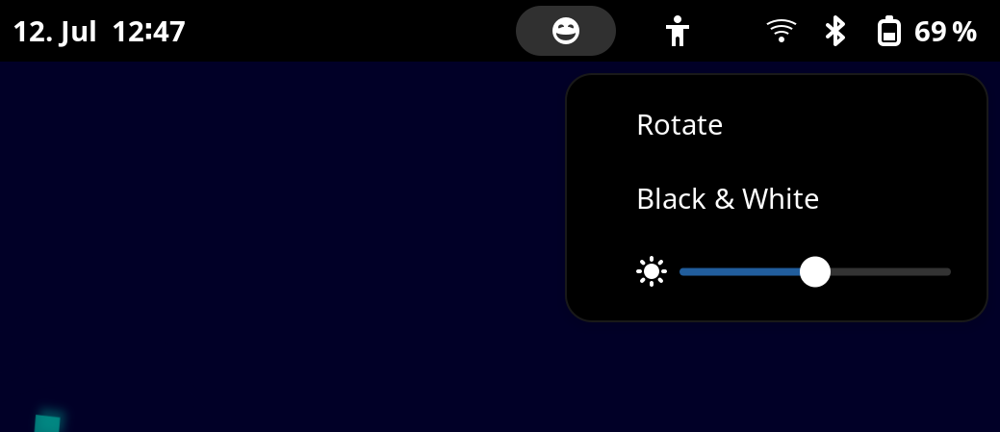

# Gnome Pinenote helper extension

This is a very very hacky Gnome extension to interface with some of the
rockchip_ebc kernel driver options. It also provides a "rotate" menu option to
easily switch between landscape and portrait mode (which is handy when
switching between desktop work and ebook reading).

**This is more a proof of concept as I never before worked with GJS. Use with
care.**

**Naturally, merge requests (or rewrites) are very welcome!**

## Installation

* Copy to the local extension directory

	rsync -avh pnhelper@m-weigand.github.com/ /home/mweigand/.local/share/gnome-shell/extensions/pnhelper@m-weigand.github.com/

* enable in gnome extension manager
* restart gnome
